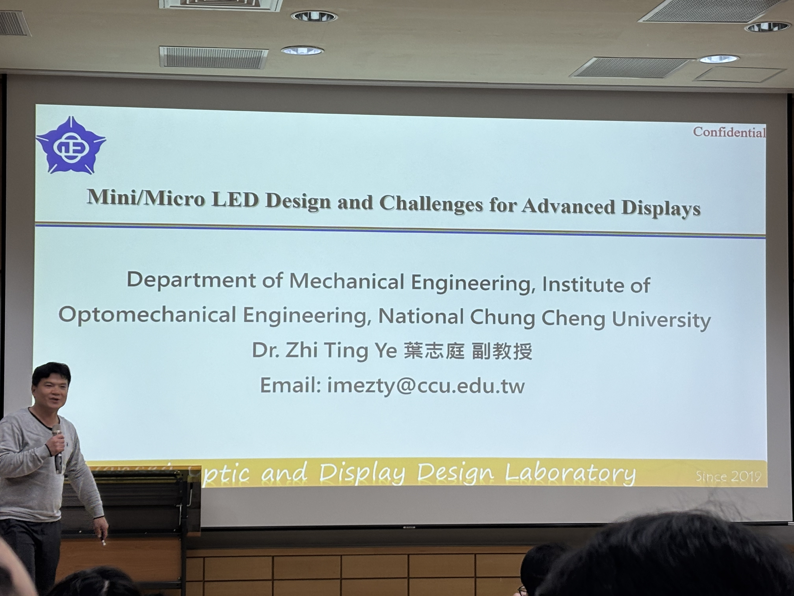
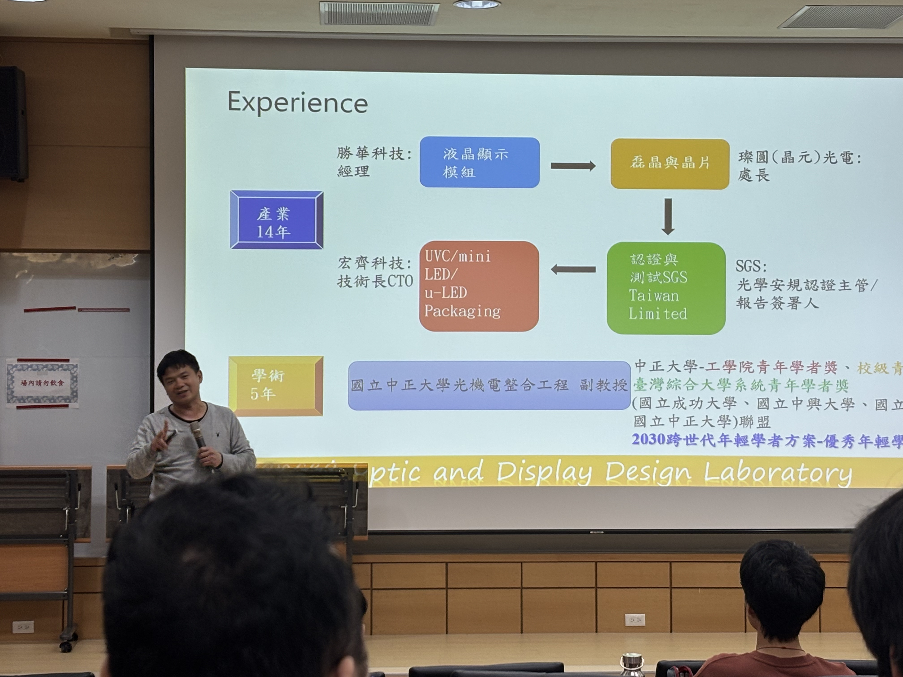
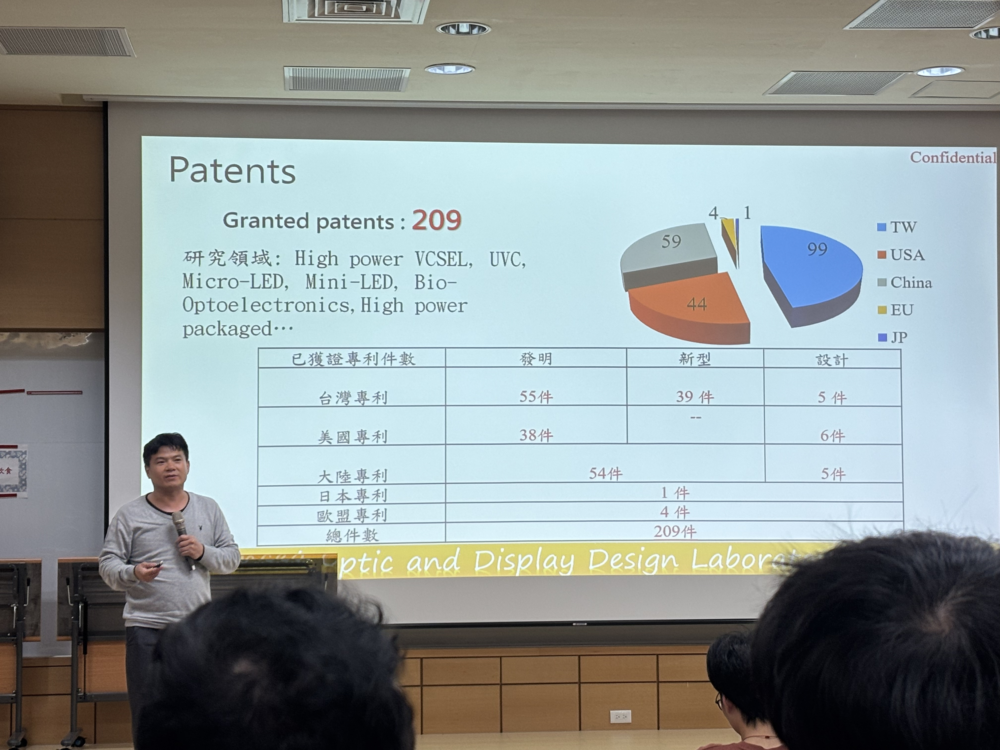

# Mini/Micro LED Design and Challenges for Advanced Displays
*20260303 中正大學 葉志庭副教授*
## 開頭
講師自我介紹。講師從健行科大一路打拚，考取交大碩博士。曾在業界深耕多年，換過不同崗位累積實戰，最後來到中正大學任教並屢獲獎項。將豐富的職涯經驗轉化為教學，申請許多專利，勉勵學生。

## 介紹產業
講師開始介紹甚麼是Mini LED以及Micro LED，主要差異為尺寸的大小

介紹Pixels Per Inch(PPI)為同一個尺寸裡，像素的密度，以及介紹關於螢幕，4快32吋4K螢幕組起來就是一塊64吋8K螢幕，因此解析度不能當作購買螢幕的唯一標準。

此圖片主要講述，LCD以及OLED的對比，目前OLED還無法取代LCD，是因為各有各的優點，講師有提到LCD的優點為便宜，OLED優點雖然更多，例如對比高，色飽和度高，但是螢幕尺寸做不大，因此應該依照需求，選擇適合的技術。

此圖片主要講述，Micro LED主要有3大製程
1. COC and Transfer，通常是30~60um之間
2. Pick and Place，通常是50um以上
3. P to P bonding，相對來說解析度高，通常是10um以下
因此解析度以及尺寸不一樣會使用不同製程。

此圖片講述，目前的顯示器為藍光+量子點所組成，提高良率以及清晰度。

講述LCD技術弱點，從背光進來，經過層層遞減從原本的100%剩下4~6%
## 介紹講師的實驗室
主要是LED利用愛心狀的結構設計，在同樣的光下，大大縮減一個區域內的LED，減少成本。

講述提高對比度，從側面看螢幕才不會灰灰的。

講述如何做出LED，並且分享經驗，n-GaN會比p-GaN先做是因為n-GaN要做的溫度需要900度，p-GaN則是600~700度，因此n-GaN需先做。

## 結尾
這次的課程讓我學習到許多有關螢幕相關的知識，以及許多生活相關的知識，例如螢幕如何選購，以及抗藍光的鏡片，不是完全將藍光濾掉，使我受益良多。
