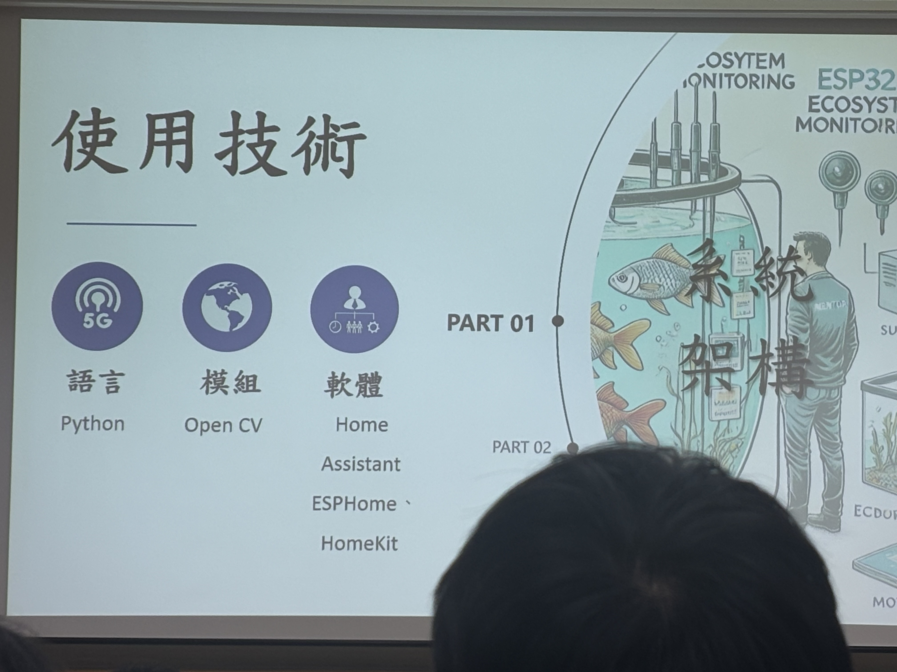
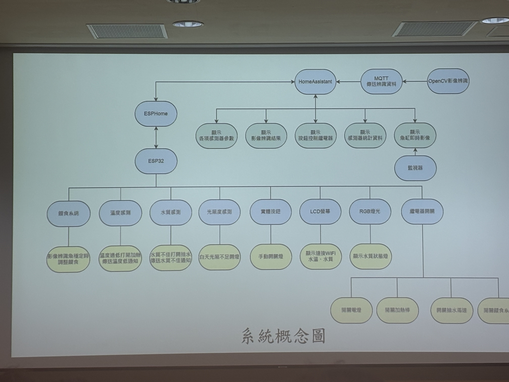
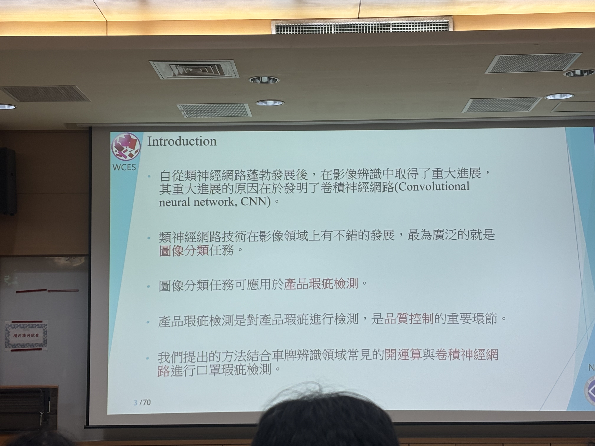
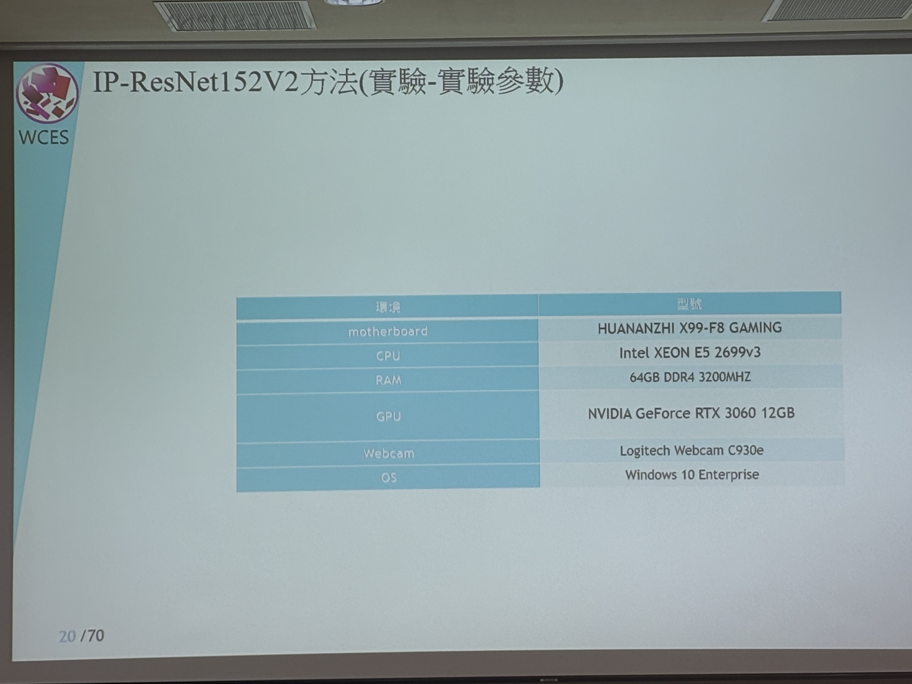
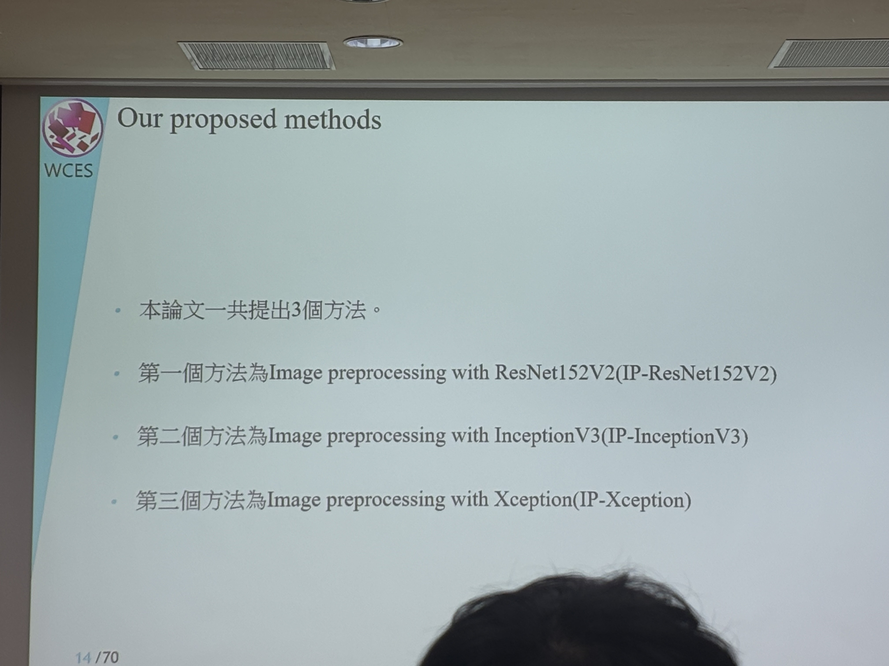
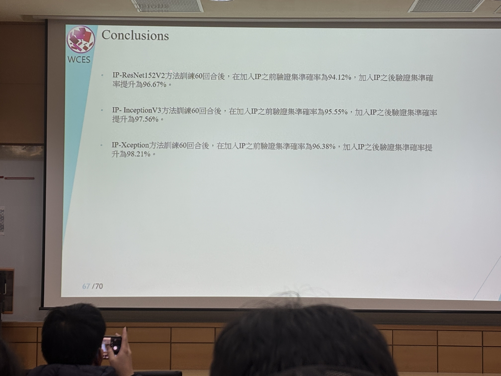
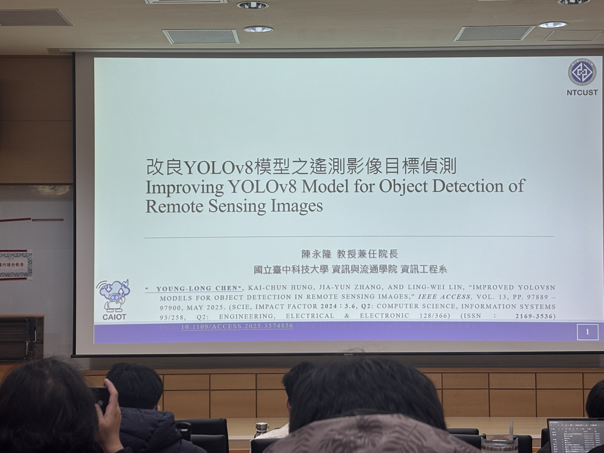

# 智慧魚缸& Mask inspection management systems& Improving YOLOv8 Model for object Detection of Remote Sensing Images
*20260310 台中科技大學 陳永隆教授*
## 智慧魚缸
創作背景：五專生希望能簡單並方便的管理魚缸。 
系統介紹：利用esp32作為主控板，搭配溫度、水質、光照度的相關Sensor，檢測整個魚缸的即時狀況。並且加上影像辨識，達到對於不同品種，不同的餵食方式。搭配餵食系統，進行定量的自動餵食。以及混濁度感測，當水質到一定的混濁度時，系統將會開啟過濾器。

## Mask inspection management systems
創作背景：希望能及時辨識，當口罩從流水線出來時是否有瑕疵。 

系統介紹：利用卷積神經網路(CNN)達到圖像分類的任務，利用圖像分類任務應用於產品瑕疵檢測，主要利用了三個方式：
1. Image preprocessing with ResNet152V2(IP-ResNet152V2)
1. Image preprocessing with InceptionV3(IP-InceptionV3)
1. Image preprocessing with Xception(IP-Xception)

基本上三種方式大同小異，利用預處理將圖片處理好，塞入別人做好的模型進行訓練，辨識出口罩是否有瑕疵，作者利用9種方法模型參數與執行時間分析，以下是他們的數值：

| 方法 | 參數量(M)| 平均耗費時間(s) | 驗證集準確率(%) |
| -------- | -------- | -------- | -------- |
| MobileNetV2[31]     | 2.2     | 0.005     | 84.56     |
| ResNet50[19]     | 23     | 0.006     | 90.78     |
| ResNet101V2[19]     | 42     | 0.009     | 91.98     |
| ResNet152V2[19]     | 58     | 0.015     | 94.12     |
| InceptionV3[24]     | 21     | 0.007     | 95.55     |
| Xception[22]     | 21     | 0.007     | 96.38     |
| IP-ResNet152V2     | 58     | 0.055     | 96.67     |
| IP-InceptionV3     | 21     | 0.047     | 97.56     |
| IP-Xception     | 21     | 0.047     | 98.21     |

從上述圖表可得知IP-Xception，較為適合做產品瑕疵檢測，耗費時間較低，且驗證集準確率較高。
## Improving YOLOv8 Model for object Detection of Remote Sensing Images

創作背景：遙測技術的快速發展使我們能夠獲取大量高解析度的遙測影像。 
系統介紹：
* Precision=正確預測正樣本的數量/預測為正樣本的數量
* Recall=正確預測正樣本的數量/所有正樣本的數量
* mAP=Precision和Recall所繪出取現下的面積 
* Parameter=模型的大小
* Inference time=處理一張圖片所需的時間

主要比較4種方式：
1. YOLOv8n
1. YOLOv8n-Bi
1. YOLOv8n-TFBi
1. YOLOv8n-TFBiCA

以下是他們的數值：

| Models | Precision(%) | Recall(%) | mAP@0.5(%) |Parameter(M) | Inference time(ms) |
| -------- | -------- | -------- | -------- | -------- | -------- |
| YOLOv8n     | 94.9     | 89.6     | 90.2     | 3.01     | 3.0     |
| YOLOv8n-Bi     | 95.3(+0.4)     | 90.9(+1.3)     | 91.7(+1.5)     | 3.02     | 3.2     |
| YOLOv8n-TFBi     | 95.6(+0.7)     | 91.0(+1.4)     | 92.4(+2.2)     | 2.86     | 3.5     |
| YOLOv8n-TFBiCA     | 96.8(+1.9)     | 94.1(+4.5)     | 94.5(4.3)     | 2.88     | 4.0     |

準確度：YOLOv8n-TFBiCA
速度：YOLOv8n
## 結尾
這次的課程讓我學習到許多有關論文寫作需要具備的技能，講師建議我們使用ai，但是提醒我們，ai所產生的資料不等於是我們做的，因此在使用上需要小心，並且如果要寫論文的話需要比較多種方式，這次上課讓我受益良多。